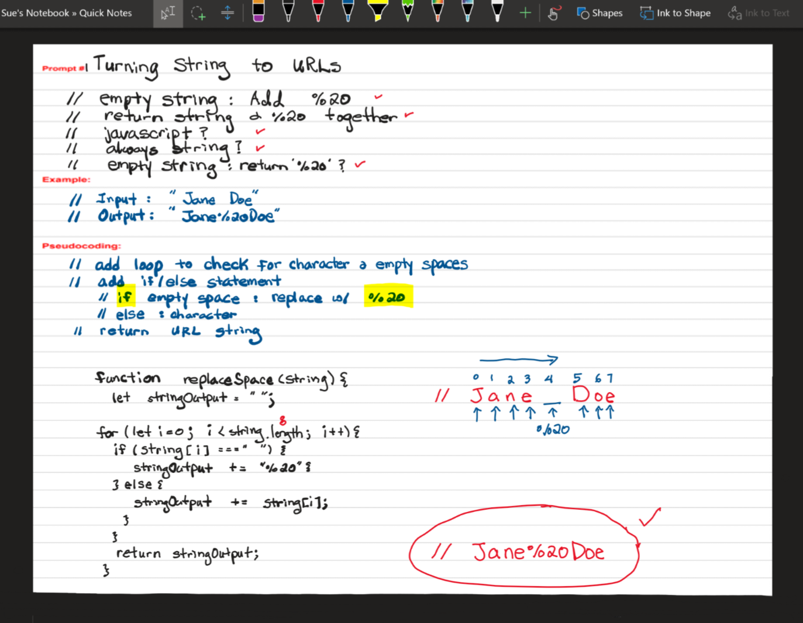

# Whiteboarding 

#### By Sue Roberts

## My prompt: #1 Turning Strings to URLs

  * URLs cannot have spaces. Instead, all spaces in a string are replaced with %20. 
  * Write an algorithm that replaces all spaces in a string with %20.
  * You may not use the replace() method or regular expressions to solve this problem. 
  * Solve the problem with and without recursion.

## Whitebording
  
  
  // Spaces in string: replace with %20  
  // Return all space in a string with %20  
   
  // EXAMPLE:  
    // Input: "Jasmine Ann Jones"  
    // Output: "Jasmine%20Ann%20Jones"  
   
  // Questions:  
    // javascript?  
    // Always string?  
    // Empty string: return %20?  
  
  // Psedocoding:  
    // add loop to check for characters & empty spaces    
    // if empty space: replace w/ %20   
    // else: character  
    // return URL string  
  
  
  
  ## Solution without recursion  
  
      function replaceSpace(string) {  
        let stringOutput = "";                       // empty string  
  
        for (let i = 0; i < string.length; i ++ ) {  // loop to find empty spaces  
          if (string[i] === " ") {                   // replace empty spaces w/ %20  
            stringOutput += "%20";  
          } else {  
            stringOutput += string[i];                // else keep character  
          }  
        }  
        return stringOutput;                          // return Strings to URLs  
      }
  
  
      // TEST:  
        // > replaceSpace("Jasmine Ann Jones");  
        // < 'Jasmine%20Ann%20Jones'  

